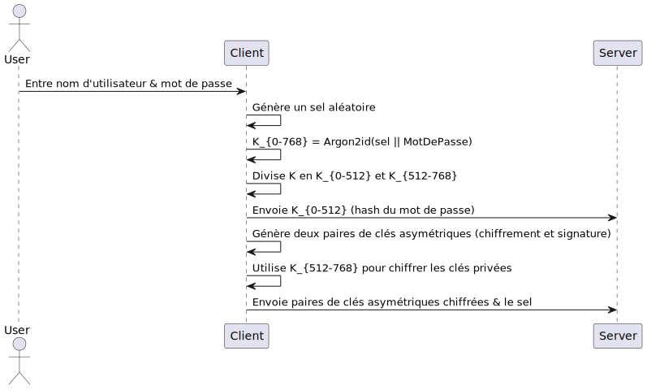
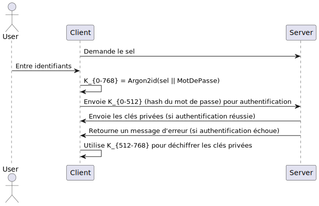
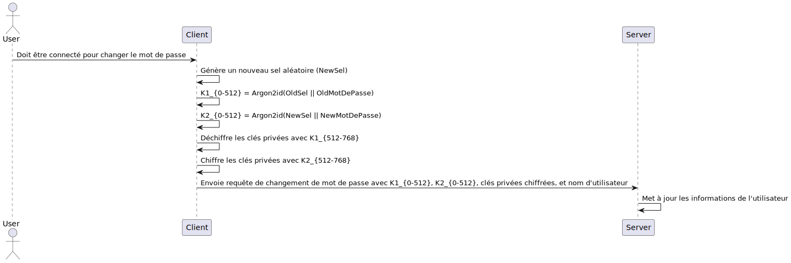
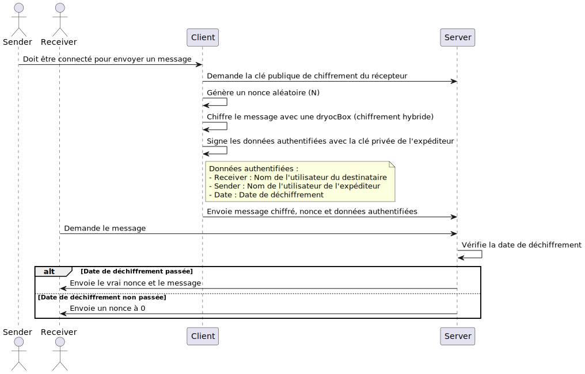
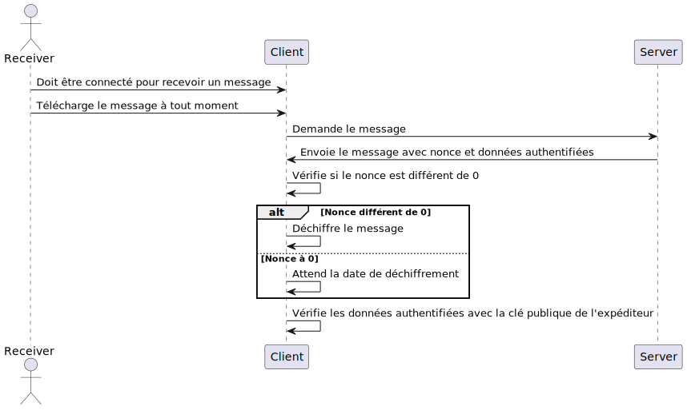

# Rapport de Projet

## Introduction
Ce rapport décrit l'architecture cryptographique et les choix effectués pour le projet. L'objectif du projet est de concevoir une application permettant aux utilisateurs d'envoyer des messages qui ne peuvent être déchiffrés qu'après une date spécifique dans le futur.

## Objectifs du Projet
- Permettre aux utilisateurs de se connecter avec un nom d'utilisateur et un mot de passe.
- Permettre aux utilisateurs de se connecter à leur compte depuis n'importe quel appareil.
- Permettre aux utilisateurs de changer leur mot de passe.
- Permettre aux utilisateurs d'envoyer des messages confidentiels à d'autres utilisateurs.
- Les messages doivent être lisibles par le destinataire uniquement après une date définie par l'expéditeur.
- Assurer que l'expéditeur du message soit authentifié et ne puisse pas répudier le message.
- Considérer des adversaires actifs et un serveur honnête mais curieux.

## Architecture Cryptographique

### Paramètres de Sécurité
Basé sur les recommandation du NIST 
https://www.keylength.com/en/4/

- **Niveau de sécurité** : 256 bits (2019 -2030)
- **Taille des clés** :  
  - symétrique : 256 bits
  - Asymétrique sur courbes elliptiques : 512 bits
  - Hash : 512 bits
- **Vecteurs d'initialisation (IVs)** : 192 bits

### Confidentialité Réseau

Pour gérer la confidentialité des discussions qui transitent sur le réseau entre le serveur et le client, l'application utilisera TLS 1.3.

### Algorithmes Cryptographiques
- **Hash** : Argon2id avec paramètres par défaut proposé par la librairie dryoc.
- **Chiffrement Symétrique** : XSalsa20-Poly1305
- **Signature Numérique** : Ed25519
- **Chiffrement Hybride** : 
  - **Dérivation de clé** : X25519
  - **Chiffrement** : XSalsa20-Poly1305

À noter que XSalsa20 utilise un nonce de 192 bits et 64 bits pour le compteur. Ce qui nous permet : 

- Taille max d'un message : $2^{64} * 2^{6}$ bits = $2^{70}$ octets
ce qui représente 1 zétaoctet. (On est large)
- Nombre max de message : $2^{80}$ messages pour éviter les collisions de nonce.

La taille et le nombre de messages limite sont tellement grands que nous n'avons pas besoin de nous en soucier.

### Aléatoire Cryptographique
Toutes les fonctions nécessitant de l'aléatoire cryptographique utiliseront la librairie rand_core avec la fonction OsRng 
qui va chercher l'entropie dans l'os (pour linux : /dev/urandom).

## Gestion des clés

## Fonctionnalités de l'Application
### Création d'un compte
1. L'utilisateur entre un nom d'utilisateur et un mot de passe.
2. Le client génère un sel aléatoire.
3. Le mot de passe et le sel sont hachés avec Argon2, ce qui retourne une sortie de 768 bits :

$$

K_{0->768} = Argon2id(\text{sel} || \text{MotDePasse})

$$

4. Les 512 premiers bits de $K$ ($K_{0-512}$) sont envoyés au serveur. Ils seront utilisés comme hash du mot de passe pour la vérification de connexion.
5. Le client génère ensuite deux paires de clés asymétriques (chiffrement et signature) pour l'utilisateur.
6. Les 256 bits restants de $K$ ($K_{512-768}$) sont utilisés comme clé pour chiffrer les clés privées générées précédemment.
7. Enfin, le client envoie ses deux paires de clés asymétriques, dont les clés privées ont été chiffrées et le sel au serveur.

8. 
### Connexion
1. L'application demande le sel au serveur.
2. L'utilisateur entre ses identifiants dans l'application.
3. Le mot de passe et le sel sont hachés avec Argon2, ce qui retourne une sortie de 768 bits :

$$

K_{0->768} = Argon2id(\text{sel} || \text{MotDePasse})

$$

4. Les 512 premiers bits de $K$ ($K_{0-512}$) sont envoyés au serveur pour l'authentification.
5. Si l'authentification réussit, le serveur envoie les clés privées de l'utilisateur ; sinon, un message d'erreur est retourné.
6. Une fois les clés privées récupérées, l'application utilise les 256 bits restants de $K$ ($K_{512-768}$) pour déchiffrer les clés privées.

Cette méthode expose l'application à une attaque par sel connu, permettant à un attaquant de créer un dictionnaire de hachages pour un utilisateur précis. 
Bien que cela soit peu problématique ici, nous pourrions utiliser Opaque ou hacher sans sel côté client, puis avec un sel côté serveur (par exemple avec SHA-512). 
J'ai choisi de ne pas l'implémenter après discussion avec l'enseignant.

### Changement de Mot de Passe
1. Le client doit être connecté pour changer son mot de passe.
2. Le client génère un nouveau sel aléatoire ($NewSel$).
3. Le client génère ensuite les deux sorties Argon2 suivantes :

$$

K1_{0-512} = Argon2id(\text{OldSel} || \text{OldMotDePasse})

$$

$$

K2_{0-512} = Argon2id(\text{NewSel} || \text{NewMotDePasse})

$$

5. Le client déchiffre les clés privées avec $K1_{512-768}$ et les chiffre à nouveau avec $K2_{512-768}$.
6. Enfin, le client envoie une requête de modification de mot de passe au serveur, incluant son nom d'utilisateur, $K1_{0-512}$, $K2_{0-512}$ et les clés privées chiffrées avec le nouveau mot de passe.
7. Le serveur vérifie les informations reçues, puis met à jour les informations de l'utilisateur.

### Envoi de Messages
1. Le client doit être connecté pour changer envoyé un message.
2. Le client demande au serveur la clé publique de chiffrement du récepteur.
3. Ensuite, il génère un nonce aléatoires $N$.
4. Le client chiffre ensuite le message avec une dryocBox qui utilise le chiffrement hybirde décrit plus haut.
5. Nous envoyons également avec le message des données authentifiées. Elles sont été signées avec la clé privée de l'expéditeur.
 - Receiver : Nom de l'utilisateur du destinataire
 - Sender : Nom de l'utilisateur de l'expéditeur
 - Date : Date de déchiffrement

6. Le client envoie le message chiffré, le nonce et les données authentifiées au serveur.
7. Le récepteur peut télécharger le message à tout moment, mais si la date de déchiffrement n'est pas encore passée,
le serveur renvoie un nonce à 0. Le vrai nonce est envoyé seulement si la date est passée.

### Lecture de Messages
1. Le client doit être connecté pour recevoir un message.
2. Le client peut télécharger à tout moment.
3. Le client vérifie si le nonce est différent de 0.
   - Si c'est le cas, le client déchiffre le message.
   - Sinon, le client attend la date de déchiffrement.
4. Le client vérifie les données authentifiées avec la clé publique de l'expéditeur.

## Considérations de Sécurité
- **Adversaires Actifs** : 
	- **Signatures Numériques** : Les messages et données authentifiés sont signés avec les clés privées des utilisateurs, empêchant ainsi la répudiation et garantissant l'authenticité des messages.
	- **Utilisation de TLS 1.3** : Toutes les communications entre le client et le serveur sont sécurisées avec TLS 1.3, protégeant les données en transit contre les interceptions et les modifications.
- **Serveur Honnête mais Curieux** : 
	-  **Chiffrement de Bout en Bout** : Les messages sont chiffrés de bout en bout, garantissant que seuls les destinataires prévus peuvent les déchiffrer.
	- **Stockage Sécurisé des Clés** : Les clés privées des utilisateurs sont stockées chiffrées sur le serveur, empêchant l'accès non autorisé même en cas de compromission du serveur
	- **Authentification Forte** : Utilisation de Argon2 pour le hachage des mots de passe, garantissant une résistance aux attaques par force brute.

## Fonctionnalités Supplémentaires (Bonus)
### Utilisation de Time-Lock Puzzles
Les Time-Lock Puzzles sont des mécanismes cryptographiques qui permettent de chiffrer des données de manière à ce qu'elles ne puissent être déchiffrées qu'après un certain temps, sans avoir besoin d'un serveur pour gérer la disponibilité des clés.

### Étapes pour Implémenter un Time-Lock Puzzle

1. **Chiffrement du Message** :

    - Le chiffrement du message reste inchangé par rapport au système initial.
2. **Création du Puzzle** :
   - Si le client décide de télécharger le message avant la date de déchiffrement, le serveur envoie toutes les informations nécessaires,
   mais génère un puzzle temporel qui prendra le temps nécessaire en fonction du temps restant avant la date prévue.
    - Le serveur chiffre le nonce avec ce puzzle pour obtenir $P(nonce)$.
3. **Envoi du Message** :
    
    - Le serveur envoie au récepteur le message chiffré et le puzzle temporel $P$.
4. **Résolution du Puzzle** :
    
    - Le récepteur peut télécharger le message à tout moment, mais il ne pourra pas déchiffrer le message avant d'avoir résolu le puzzle temporel $P$.
    - Si la date prévue est atteinte, il pourra soit récupérer le nonce en ayant résolu le puzzle s'il est hors ligne, soit le récupérer directement sur le serveur.

#### Inconvénients

- Le temps de calcul pour résoudre le puzzle doit être soigneusement choisi pour correspondre à la date prévue.
- Peut nécessiter des ressources de calcul importantes pour résoudre le puzzle.
- La puissance de calcul varie d'un client à l'autre, donc le programme doit s'adapter en fonction de la machine du client.

## Conclusion
En résumé, ce projet a mis en œuvre une architecture cryptographique robuste pour assurer la sécurité des communications entre les utilisateurs. En utilisant des algorithmes de chiffrement modernes et des techniques de gestion des clés sécurisées, nous avons pu garantir la confidentialité, l'intégrité et l'authenticité des messages échangés. Les fonctionnalités telles que la connexion sécurisée, le changement de mot de passe et l'envoi de messages différés ont été soigneusement conçues pour répondre aux exigences de sécurité tout en offrant une expérience utilisateur fluide. Les considérations de sécurité, y compris la protection contre les adversaires actifs et les serveurs honnêtes mais curieux, ont été intégrées tout au long du développement.
